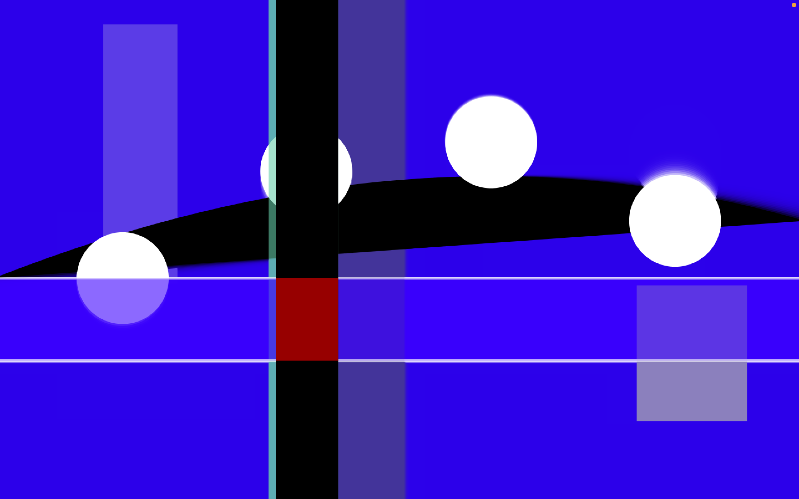
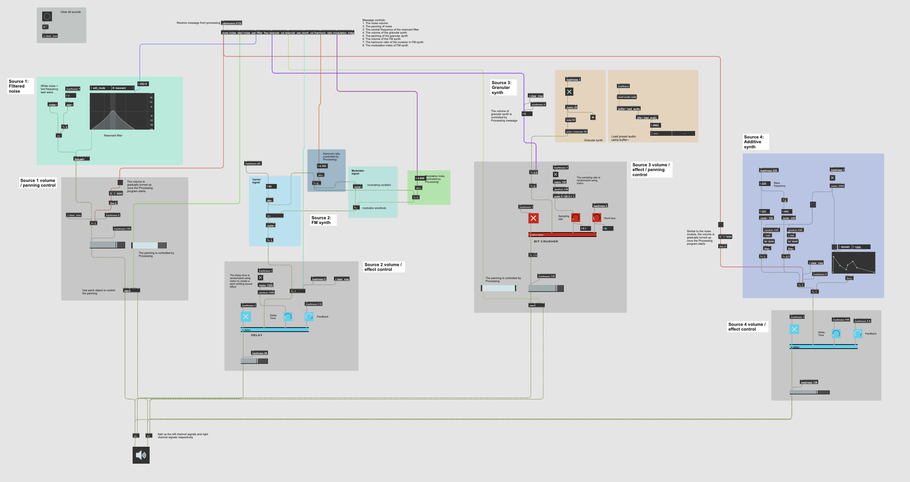

# WAVE / FORM: An Audiovisual Artwork Based on Max and Processing

### Author

Jiafeng Chen

### Abstract

WAVE / FORM is a generative audiovisual artwork created with Max 8 and Processing. Through a rich real-time variation of sounds and shapes, the artwork explores a balanced tension between the feeling of stability and chaos. While an overall calmness is set by the circular shapes’ harmonic motion and the wave-like soundscape, the whole scene could randomly evolve into a restless state of dazzling flashes and distorted bleeps. This non-interactive artwork is intended to create an immersive audiovisual experience for its viewer through their screen and stereo audio device. The audio of WAVE / FORM is generated by synthesizers in Max 8, and the visuals are created with Processing. The two software communicate through OSC, and all the events are generated in real time based on a collaboration of periodic and random control signals.

**Visual demo:**

**Video demo:** https://vimeo.com/752048616

**Max Interface:**

